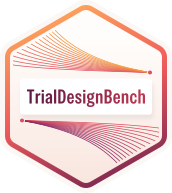

# trialdesignbench 

[](https://pypi.org/project/trialdesignbench/)

[](https://github.com/BBSW-org/TrialDesignBench/actions/workflows/ci-tests.yml)
[](https://github.com/BBSW-org/TrialDesignBench/actions/workflows/mypy.yml)
[](https://github.com/BBSW-org/TrialDesignBench/actions/workflows/ruff-check.yml)
[](https://bbsw-org.github.io/TrialDesignBench/)


TrialDesignBench is a community-driven benchmark for evaluating AI agents in
clinical trial design. The benchmark currently focuses on two core tasks:

- **Design reproduction:** Given a Statistical Analysis Plan (SAP) or
  study protocol, evaluate how accurately AI agents can reproduce the
  trial design using R.
- **Design generation:** Given high-level clinical requirements,
  evaluate the ability of AI agents to draft new clinical trial designs using R.

## How it works

`trialdesignbench` is a Python package and a thin evaluation framework.
It owns the task schema, task materialization, the grader, scoring rules,
aggregation, and provenance.

[Harbor](https://github.com/harbor-framework/harbor) is the execution backend
that runs agent harnesses in Docker. The two interact only through files:
Harbor task directories, a generated `job.yaml`, and the job directory
that Harbor writes. The currently supported agents are:

- Claude Code
- Codex CLI
- Grok Build
- OpenCode

Other Harbor agents are refused because they cannot verifiably run closed book.
Reasoning effort is a first-class run setting next to the agent and model.
It is checked per agent before launch, recorded with every job, and
kept apart in reports.

## Installation

```bash
uv add trialdesignbench           # dataset, build, grade, report
uv add "trialdesignbench[judge]"  # + Anthropic SDK for the rubric judge
uv add "trialdesignbench[harbor]" # + Harbor to run agents
```

For development:

```bash
git clone https://github.com/BBSW-org/TrialDesignBench.git
cd TrialDesignBench
uv sync --dev
```

## Quick start

Canonical dataset from curated submissions and protocol/SAP Markdown:

```bash
uv run tdb dataset import \
	data/json/*.json \
	--out tmp/dataset \
	--documents docs/
uv run tdb dataset check tmp/dataset
```

Shared environment image, then Harbor tasks:

```bash
uv run tdb env build
uv run tdb build \
	tmp/dataset \
	--out tmp/tasks
```

Run an agent with the network canary, then aggregate. The agent reads its
provider's API key (here the `ANTHROPIC_API_KEY`). The rubric judge always
needs `ANTHROPIC_API_KEY`.

```bash
export ANTHROPIC_API_KEY=...
uv run tdb run \
	--tasks tmp/tasks \
	--agent claude-code \
	--model anthropic/claude-opus-5-5 \
	--effort high \
	--n-attempts 3 \
	--canary
uv run tdb report \
	"jobs/<job-name>" \
	--format md
```

Grade any directory with output.json and output.R, no Harbor needed:

```bash
uv run tdb grade \
	path/to/submission \
	--rubrics "tmp/dataset/<task_id>/rubrics.json" \
	--out "graded/<task_id>" \
	--trajectory path/to/trajectory.json
```

See the [documentation](https://bbsw-org.github.io/TrialDesignBench/) for the
dataset format, supported agents and their credentials, the judge, environment
and network policy, grading rules, and reproducibility guarantees.

## Design principles

- **Hidden rubrics.** Agents see the prompt template, the question skeleton,
  and the source document. Rubrics live only in each task's `tests/`
  directory, which runs in a separate verifier container.
- **Decoupled grading.** `tdb grade` is a pure function of the submission
  (`output.json`, `output.R`, trajectory), the rubrics, and the judge
  configuration. It runs the same inside Harbor, standalone, and in tests, so
  recorded runs can be regraded and external submissions compared.
- **Fail loudly.** Every grading error is an explicit status and zeroes the
  reward; a missing R runtime or trajectory is never a pass.
- **Closed book is enforced.** While the agent runs, egress is an allowlist of
  model API hosts; server-side web tools are disabled in the harness, the
  grader scans the trajectory for violations, and a network canary proves the
  policy holds.
- **One pinned image** for agent and verifier: R with a dated CRAN snapshot,
  Python, Node, pinned agent CLIs and closed book agent settings, and the
  [pharma skills](https://github.com/RConsortium/pharma-skills).
